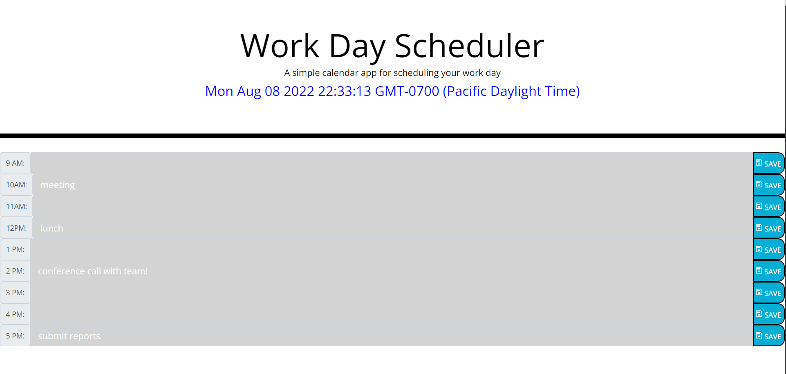

# My Daily Planner  
---

## Week 05 Challenge - Accepted

### Introduction: 

This project was intended to be a daily scheduler that would adjust based on the hour of the work day. It was refactored to use the third party web API's like Moment.js, jQuery, and Fonts Awesome.

### Highlights:

The Daily Planner was built with all the API's mentioned above and a fourth was added specifically for a save button icon from Google. They offer a lot of customization, you can find them here: [Google Fonts](https://fonts.google.com/icons?preview.text=John%20Lopez&preview.text_type=custom). The other notable is the date in the header was accentuated to clearly standout for the user.

The Image here represents an example of a few saved schedule events after the work day has passed. 

### Summary: 

This is a great tool for anybody trying to make sure they dont miss a daily goal/task. 

--- 
**Check out the web page below:**
##
[My Daily Planner](https://think-again-coder.github.io/05MyDailyPlanner/) <---- Click Here!
## 
## - John Lopez -